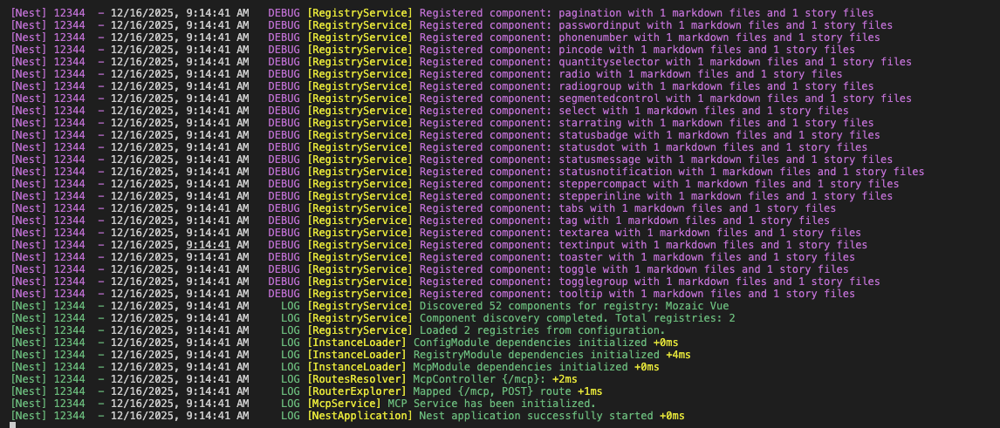
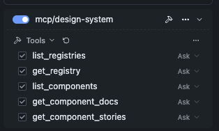
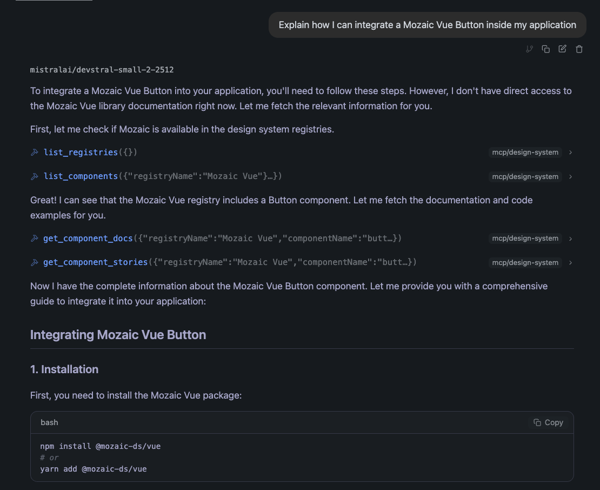
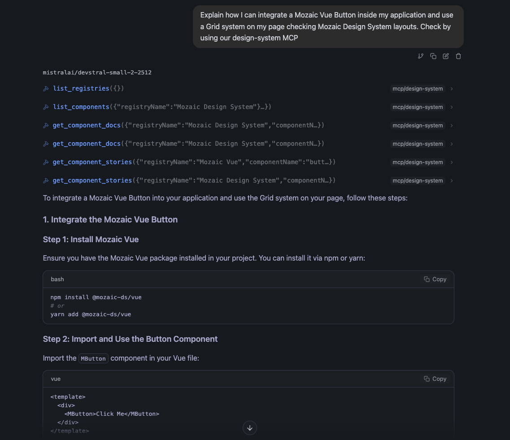
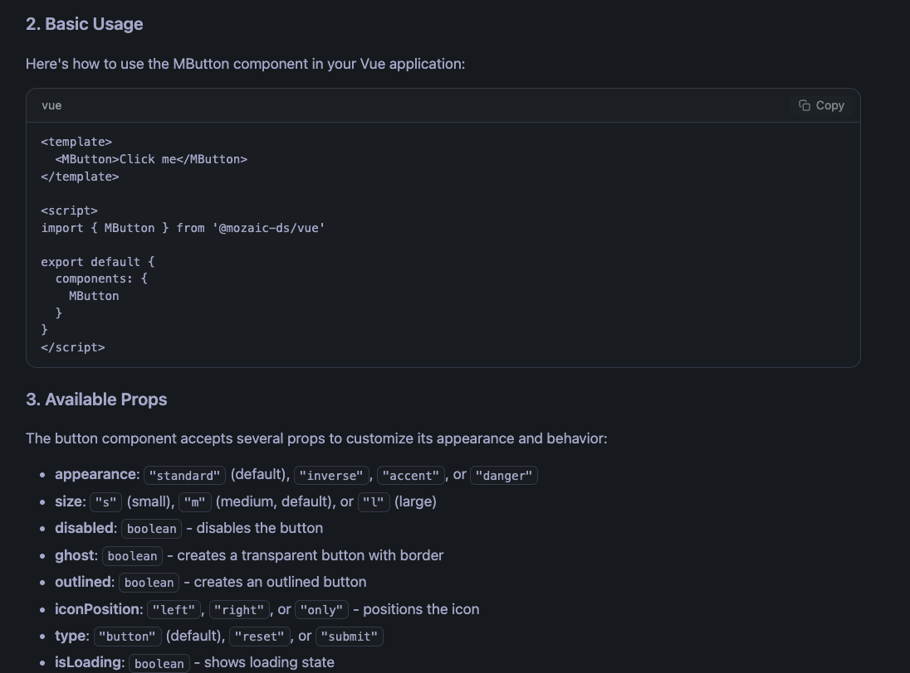

# MCP Server for Design Systems

This project exposes one or more Design Systems through a **Model Context Protocol (MCP) server**. The MCP server allows LLM-based tools to:

- Understand what Design System registries are available
- Know when and why to use a given registry
- Discover available UI components
- Retrieve usage documentation (Markdown)
- Retrieve implementation examples (Storybook stories)
- Provide installation and usage guidance

## Project Setup

```bash
$ npm install
```

## Compile and Run the Project

```bash
# development
$ npm run start

# watch mode
$ npm run start:dev

# production mode
$ npm run start:prod
```

## Configuration

The MCP server is configured using the `config/registries.json` file. This file defines the Design Systems (registries) that will be exposed through the MCP server.

### Example Configuration

The `config/registries.json` file includes an array of registries, each with the following properties:

- **name**: The name of the Design System.
- **installCommand**: The command to install the Design System package.
- **description**: A brief description of the Design System.
- **useCases**: An array of use cases (e.g., HTML, SCSS, Vue).
- **components**: Configuration for discovering components and their documentation.

### Components Configuration

The `components` object specifies the paths and file extensions for:
- **Markdown documentation**: Used for component descriptions, usage guidelines, and best practices.
- **Storybook stories**: Used as the authoritative source for code examples and props usage.

Example:
```json
{
  "name": "Mozaic Design System",
  "installCommand": "npm install @mozaic-ds/styles",
  "description": "SCSS implementation of the Mozaic Design System.",
  "useCases": ["HTML", "SCSS"],
  "components": {
    "basePath": "design-systems/mozaic-styles-main",
    "componentDir": "packages/styles",
    "componentSubDirs": ["components", "layouts"],
    "componentFileExtensions": [".md"],
    "storiesDir": "src/stories",
    "storiesSubDirs": ["components", "layouts"],
    "storiesFileExtensions": [".js"]
  }
}
```

## How It Works

1. **Registry Discovery**: The MCP server reads the `config/registries.json` file to discover available Design Systems.
2. **Component Documentation**: For each registry, the server scans the specified directories for Markdown files and Storybook stories.
3. **Exposing Tools**: The MCP server exposes tools that allow LLM-based applications to:
   - List available registries.
   - Retrieve registry details (description, installation instructions).
   - List components of a registry.
   - Retrieve component documentation (Markdown).
   - Retrieve component code examples (Storybook stories).

## Usage

To use the MCP server, ensure that:
1. The `config/registries.json` file is correctly configured with the paths to your Design System documentation and Storybook stories.
2. The Markdown files and Storybook stories are available at the specified locations.

Once configured, start the server using:

```bash
$ npm run start:dev
```

The MCP server will automatically expose your Design System documentation and Storybook stories, making them available for LLM-based tools to consume.





## Resources

- [NestJS Documentation](https://docs.nestjs.com)
- [Model Context Protocol (MCP) SDK](https://github.com/modelcontextprotocol/typescript-sdk)

## Proof of Concept

### Retrieve Design System information


### Vue Usage



### Mixing response of two registries



